<div align="center">
<!-- ============ HERO ============ -->
 


<!-- ============ ANIMATED TYPING HEADER ============ -->
<a href="#">

</a>
<br/>
 
 

</div>
<br/>
<!-- ============ PROFESSIONAL INTRODUCTION ============ -->
<div align="center">
"Systems thinking meets financial precision."
</div>
<br/>

<br/>
<!-- ============ ABOUT ME ============ -->
 About Me
<table width="100%">
<tr>
<td width="60%" valign="top">
I'm a Workday Financial Systems Analyst with 4+ years of experience architecting and optimizing financial ecosystems for enterprise organizations. My work sits at the intersection of finance, systems engineering, and process design — translating complex business requirements into clean, scalable Workday configurations.
I care about precision, auditability, and elegant system design — the same way a good engineer cares about clean code.
</td>
<td width="40%" valign="top">
```yaml
role: Financial Systems Analyst
platform: Workday
focus:
  - Financials
  - Adaptive Planning
  - Integrations
  - Reporting & Analytics
experience: 4+ years
mindset: systems-first
```
</td>
</tr>
</table>
<br/>
<!-- ============ CURRENT POSITION ============ -->
 Current Position
<div align="center">
	
Role	Workday Financial Systems Analyst
Focus Areas	Financials · Reporting · Integrations · Business Process Optimization
Experience	4+ Years in Enterprise ERP Systems
Industry	Financial Technology / Enterprise Software
Status	Open to Impactful Opportunities
</div>
<br/>
<!-- ============ WORKDAY EXPERTISE ============ -->
 Workday Expertise
<div align="center">
<table width="100%">
<tr>
<td align="center" width="25%">
Financials
Core Financials · GL · AP/AR · Banking & Settlement · Procurement
</td>
<td align="center" width="25%">
Adaptive Planning
Budgeting · Forecasting · Financial Modeling
</td>
<td align="center" width="25%">
Integrations
Core Connectors · EIB · Studio · RaaS
</td>
<td align="center" width="25%">
Reporting
Custom Reports · Calculated Fields · Dashboards
</td>
</tr>
</table>
<br/>


<br/>


</div>
<br/>
<!-- ============ TECHNOLOGY STACK ============ -->
 Technology Stack
<div align="center">

<br/><br/>


</div>
<br/>
<!-- ============ GITHUB STATISTICS ============ -->
 GitHub Statistics
<div align="center">


<br/>

</div>
<br/>
<!-- ============ CONTRIBUTION GRAPH ============ -->
 Contribution Graph
<div align="center">

</div>
<br/>
<!-- ============ ACTIVITY GRAPH ============ -->
 Recent Activity
<div align="center">
<!--START_SECTION:activity-->
<!-- This section auto-fills via the "github-readme-activity" GitHub Action -->
<!--END_SECTION:activity-->
</div>
<br/>
<!-- ============ TROPHY SECTION ============ -->
 Trophies
<div align="center">

</div>
<br/>
<!-- ============ FEATURED PROJECTS ============ -->
 Featured Projects
<table width="100%">
<tr>
<td width="50%" valign="top">
Workday Financial Reporting Toolkit
Custom report and calculated-field library that standardized month-end close reporting across business units.
`Workday` `Report Writer` `Calculated Fields`
View Repository →
</td>
<td width="50%" valign="top">
EIB Integration Framework
Reusable inbound/outbound integration templates reducing new integration build time significantly.
`EIB` `Studio` `XSLT`
View Repository →
</td>
</tr>
<tr>
<td width="50%" valign="top">
Adaptive Planning Forecast Model
Driver-based forecasting model connecting operational metrics to financial planning outputs.
`Adaptive Planning` `Financial Modeling`
View Repository →
</td>
<td width="50%" valign="top">
Business Process Optimization Suite
Documentation and configuration set for streamlined approval workflows and security groups.
`Business Process Framework` `Security`
View Repository →
</td>
</tr>
</table>
<br/>
<!-- ============ CERTIFICATIONS ============ -->
 Certifications
<div align="center">


<br/>


</div>
<br/>
<!-- ============ CAREER TIMELINE ============ -->
 Career Timeline
```
2026 ── Senior Workday Financial Systems Analyst
  │      Leading Financials configuration and integration strategy
  │
2024 ── Workday Financial Systems Analyst
  │      Owned reporting, security, and business process design
  │
2022 ── Workday Financials Associate Analyst
  │      Supported core Financials configuration and testing
  │
2021 ── Entered Financial Systems / ERP Domain
         Foundations in accounting systems and process analysis
```
<br/>
<!-- ============ LEARNING ROADMAP ============ -->
 Learning Roadmap
[x] Workday Financials Core Configuration
[x] Workday Report Writer & Calculated Fields
[x] EIB & Core Connector Integrations
[ ] Workday Studio Advanced Integrations
[ ] Workday Prism Analytics
[ ] Workday Extend
[ ] SQL for Advanced Financial Data Analysis
<br/>
<!-- ============ PROFESSIONAL ACHIEVEMENTS ============ -->
 Professional Achievements
<table width="100%">
<tr>
<td width="33%" align="center">
Process Efficiency
Reduced month-end close reporting time through report standardization
</td>
<td width="33%" align="center">
Integration Reliability
Built EIB templates adopted as the team standard for new integrations
</td>
<td width="33%" align="center">
Cross-Functional Impact
Partnered with Finance, HR, and IT to deliver enterprise-wide system upgrades
</td>
</tr>
</table>
<br/>

<br/>
<!-- ============ CONTACT ============ -->
 Let's Connect
<div align="center">
<a href="https://linkedin.com/in/YOUR_LINKEDIN">
  
</a>
<a href="mailto:your.email@example.com">
  
</a>
<a href="https://github.com/YOUR_USERNAME">
  
</a>
</div>
<br/>
<!-- ============ FOOTER ============ -->
<div align="center">

<br/><br/>

<sub>Designed with precision · Built for scale</sub>
</div>
